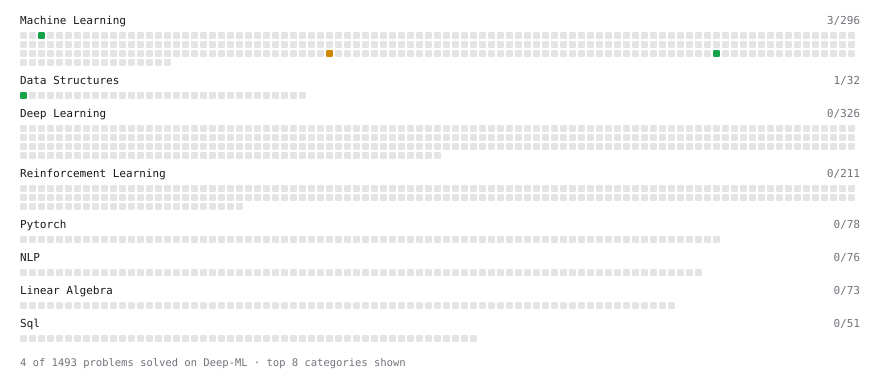

# Deep-ML

My machine learning practice from [Deep-ML](https://www.deep-ml.com). Every solution here was written by hand.

**5** solved · 5 problems · 0 labs · 0 math

[**Browse the interactive portfolio**](https://letqo.github.io/deep-ml/) to replay this filling in over time.

## Problems

| | Difficulty | Solved | |
| --- | --- | --- | --- |
| [Feature Scaling Implementation](https://www.deep-ml.com/problems/16) | easy | 2026-10-01 | [solution](problems/0016-feature-scaling-implementation) |
| [Min-Max Scaling of Feature Values](https://www.deep-ml.com/problems/112) | easy | 2026-10-01 | [solution](problems/0112-min-max-scaling-of-feature-values) |
| [One-Hot Encoding of Nominal Values](https://www.deep-ml.com/problems/34) | easy | 2026-10-01 | [solution](problems/0034-one-hot-encoding-of-nominal-values) |
| [Random Train/Validation/Test Split with Shuffling](https://www.deep-ml.com/problems/1058) | easy | 2026-10-01 | [solution](problems/1058-random-train-validation-test-split-with-shuffling) |
| [StandardScaler Fit and Transform](https://www.deep-ml.com/problems/842) | medium | 2026-10-01 | [solution](problems/0842-standardscaler-fit-and-transform) |

---

_This file is regenerated by Deep-ML on every push._
